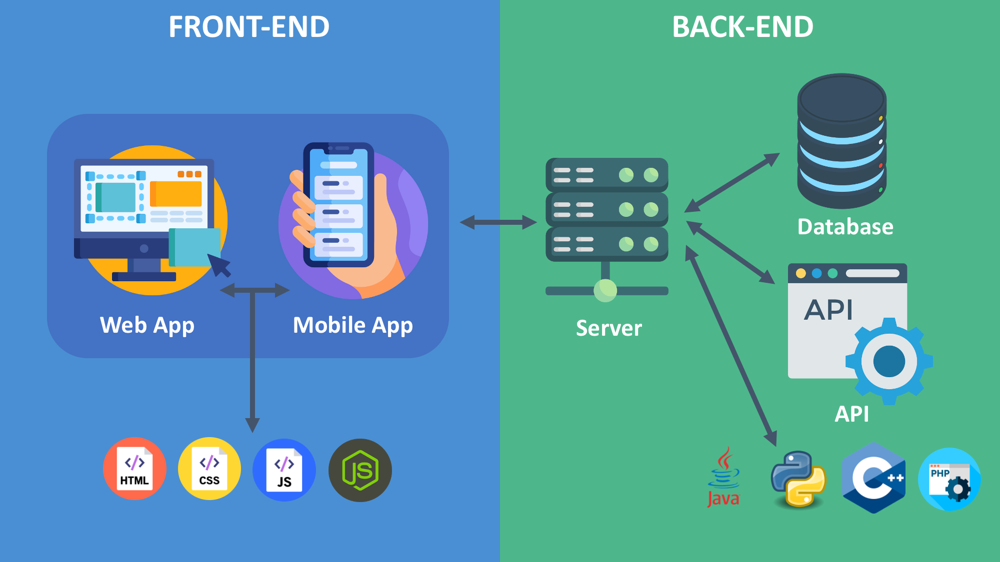
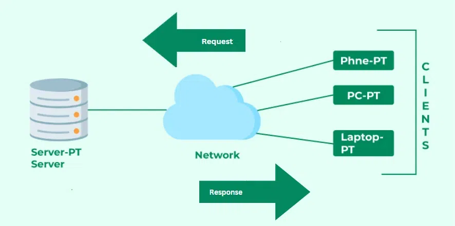
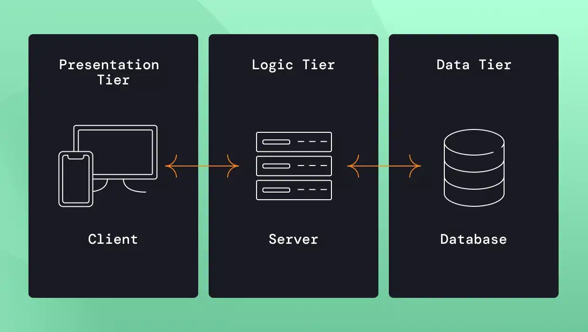
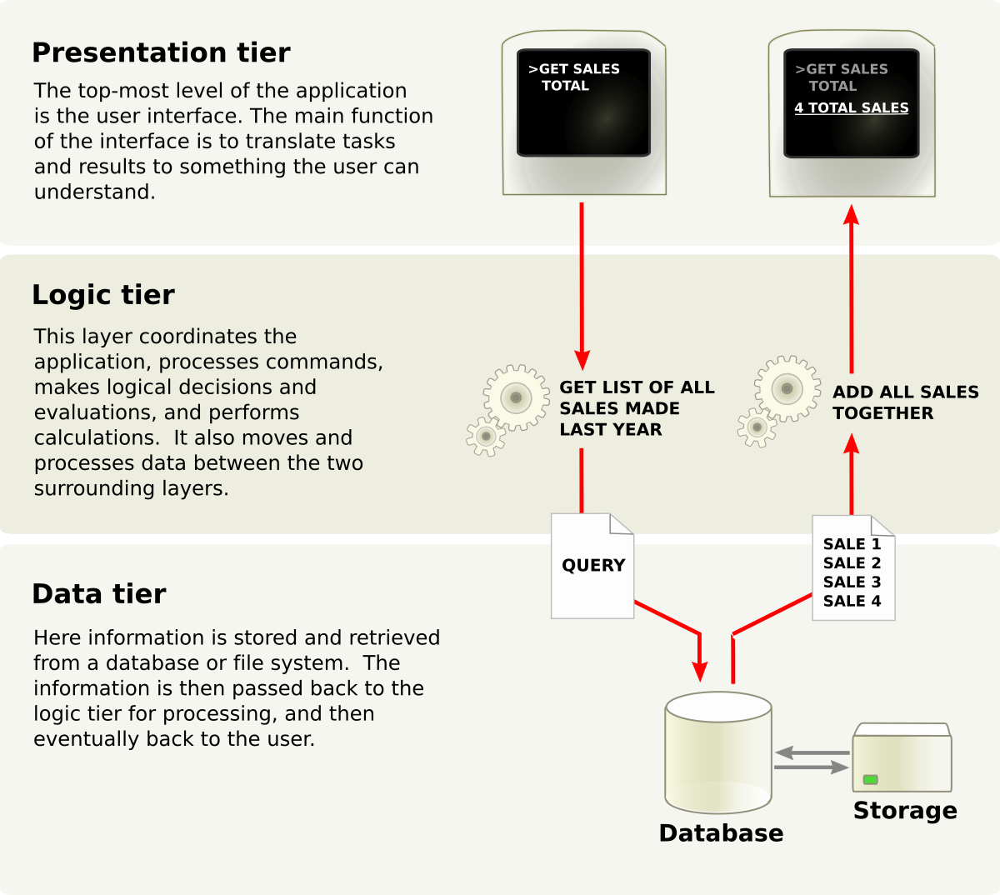

                    question 1
1. Role of front end in web application is to manage the user interface  and user interaction 
 The frontend is what your users see and includes visual elements like buttons, checkboxes, graphics, and text messages. It allows your users to interact with your application.Its primary functions include: 

User Interface (i): Building and rendering the visual elements, layout, and design of the application using languages like HTML, CSS, and JavaScript.

User Interaction (ii): Handling user inputs, events (like clicks or typing), and providing dynamic feedback to the user without necessarily requiring a full page reload. 

While the front end initiates communication with the backend (e.g., by making API calls to fetch or send data), it is the backend's primary role to process those requests, manage the server logic, and interact with the database. The front end's role in this interaction is primarily to display the data received from the backend.

                             question 2

2. A backend role involves building and maintaining the server-side of applications—the "behind-the-scenes" parts like databases, APIs, and server logic that users don't see, ensuring data processing, security, and functionality work smoothly to support the frontend (what users interact with). These developers use languages like Python, Java, or Node.js to manage data storage, user authentication, and application architecture, making sure everything runs efficiently and scales.

Database handling:A crucial function of the backend is managing the application's data. The backend interacts with databases (e.g., MySQL, PostgreSQL, MongoDB) to store, organize, retrieve, and manage data persistently. This ensures that important information like user details, product inventories, or transaction histories are saved and accessible. It enforces rules and constraints to maintain data consistency, accuracy, and reliability, preventing bad data from entering the system. 

Security and authentication
The backend is the primary line of defense for sensitive information and overall system security. It verifies user identities through secure login processes and determines which features or data a user is authorized to access (e.g., ensuring an admin has different access rights than a standard user).it is responsible for protecting sensitive data both at rest and in transit through measures like encryption (e.g., using HTTPS) and secure coding practices to defend against threats like SQL injection and cross-site scripting (XSS) attacks.

Server-side processing:The backend manages all operations that run on the server, which is a computer that listens for and responds to client (frontend) requests. 
it contains the core application logic, which defines how the application behaves and processes data based on user input or system events.It receives HTTP requests from the frontend (e.g., when a user clicks a button or fills a form), processes them, interacts with the database if needed, and generates an appropriate response (e.g., an HTML page or JSON data) to send back to the client.

                             question 3

3. business logic refers to the set of rules, calculations, and processes that define how a business operates and how its data is managed within an application. It encompasses the core functionalities that are specific to the business domain, such as workflows, decision-making processes,and data transformations. It is implemented in the backend of an application and is responsible for ensuring that the application behaves according to the business requirements and objectives. It acts as a bridge between the user interface (frontend) and the data storage (database), processing user inputs and generating appropriate outputs based on the defined rules and conditions.
 3 real-world examples where business logic is applied in a web application are:
1. E-commerce Platform: In an online shopping application, business logic is used to manage product inventory, calculate prices with discounts and taxes, process orders, and handle payment transactions. For example, when a user adds items to their cart and proceeds to checkout, the business logic ensures that the total amount is calculated correctly based on the selected products, applied discounts, and shipping fees.
2. Banking Application: In a banking web application, business logic is responsible for managing account balances, processing transactions, calculating interest rates, and enforcing security measures. For instance, when a user initiates a fund transfer, the business logic verifies the account balance, checks for sufficient funds, and updates both the sender's and recipient's account balances accordingly.
3. Social Media Platform: In a social networking application, business logic governs user interactions, content management, and privacy settings. For example, when a user posts a status update, the business logic determines who can view the post based on the user's privacy settings, manages notifications for friends, and handles the storage of the post in the database.

                                 question 4

The Client-Server Model is a distributed computing setup where clients (devices/apps requesting data) send requests over a network to servers (powerful machines providing data/services), which process the request and send back a response, forming a core Request-Response cycle for the internet, email, and cloud services, as seen when your browser (client) asks Google (server) for a webpage. 
Who is the Client?
A client is a device (like a phone, laptop) or software application (like a web browser, email app) that requests services, data, or resources from a server.Initiates communication and consumes services (e.g., viewing emails, loading a webpage). 
Who is the Server?
 A server is a powerful computer or program that provides resources, data, or services to clients.Listens for requests, processes them, and sends back the requested information or service.

How Communication Happens
Request: The client sends a request (e.g., "Get me this webpage") to the server using specific rules (protocols like HTTP) over a network (the Internet).
Processing: The server receives the request, understands it, performs the necessary actions (like finding the webpage file).
Response: The server sends the processed data or service back to the client.
Delivery: The client receives the response and displays the information (e.g., your browser renders the webpage). 

                                 question 5

4. the 3-tier architecture is a client-server architecture that separates the user interface, application processing, and data management into three distinct tiers or layers. it typically consists of a presentation tier (frontend), a logic tier (backend), and a data tier (database). This separation allows for better scalability, maintainability, and flexibility in application development and deployment.

1. Presentation Tier (User Interface Layer)
this is the user interface or client layer of the application. It is responsible for presenting data to the user and receiving input from the user. This tier communicates with the Application Tier to process user requests and display relevant information. This tier can be a web browser, mobile app, or desktop application. It ensures the application is user-friendly by providing interfaces such as web browsers, mobile apps, or desktop applications.

2. Application Tier ( Business Logic Layer)
The application tier is the middle layer of the 3-tier architecture. It acts as the intermediary between the Presentation Tier and the Data Management Tier. It is responsible for processing and managing the business logic of the application. This tier communicates with the presentation tier to receive user input and communicates with the data management tier to retrieve or store data. This tier may include application servers, web servers, or APIs. It houses the application's core functionality, such as calculating values, applying rules, handling workflows, etc

3. Data Management Tier ( Database Layer)
The Data Management tier is the bottom layer of the 3-tier architecture. It is responsible for managing and storing data. This tier can include databases, data warehouses, or any other persistent data storage solution. The data management tier communicates with the application tier save, retrieve, or manipulate data according to the business logic.It ensures that the data is safely stored, retrieved, and maintained. It handles the database connections and ensures data integrity.

                    question 6

JavaScript, with the help of Node. js, has proven to be an excellent choice for backend development. Its asynchronous nature, unified language for both frontend and backend, and vast ecosystem of libraries and frameworks make best for building scalable and efficient web applications.
Performance
The key reason for JavaScript's strong performance in backend scenarios is its unique execution model within the Node.js runtime environment: 
Asynchronous I/O Model: Node.js operates on a single-threaded, event-driven model that handles input/output (I/O) operations asynchronously. 
High Throughput: The non-blocking nature is ideal for data-intensive, real-time applications (e.g., chat apps, streaming services, online games) that require high throughput and low latency.
V8 Engine: Node.js is powered by Google's V8 JavaScript engine, the same high-performance engine used in Chrome. It compiles JavaScript code into native machine code rapidly, contributing to fast execution speeds.

Ecosystem
The Node.js ecosystem is one of the largest and most vibrant in the software development world: 
NPM (Node Package Manager): NPM is the default package manager for Node.js and the largest software registry in the world. It provides developers access to a vast repository of reusable packages (libraries, tools, and frameworks) that significantly speed up development by avoiding the need to write common functionality from scratch. Using JavaScript on both the frontend and backend allows for the sharing of code, logic, and data validation rules, which streamlines development and reduces complexity.
Large Community and Resources: The widespread popularity of JavaScript ensures an extensive community, ample documentation, tutorials, and support channels, making problem-solving easier and development smoother. 

Popular Backend Frameworks
Several robust and mature frameworks are built on Node.js, facilitating the creation of various backend services: 
Express.js,NestJS.Sails.js,Fastify